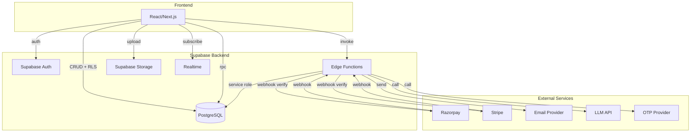

# SUPABASE BACKEND SPECIFICATION

**Kramashah — Multi-Industry Service Business Management SaaS**
**Single Source of Truth for Backend Architecture & Migration Planning**

> **Status:** This document maps the CURRENT Base44 implementation and the INTENDED Supabase replacement. Items marked `PROPOSED` are not yet implemented. The document is a living specification — it must be updated whenever any backend-related change is made.

---

## Document Structure

This master specification is split across multiple files for maintainability:

| File | Sections |
|------|----------|
| **`SUPABASE_BACKEND_SPEC.md`** (this file) | Overview, Architecture, Env Vars, Auth, Users & Roles, Change Log |
| `docs/supabase/02_DATABASE_TABLES.md` | Database Tables, Relationships |
| `docs/supabase/03_FUNCTIONS.md` | Database Functions/RPC, Edge Functions, Triggers |
| `docs/supabase/04_SECURITY.md` | RLS Policies, Storage Buckets, Security Checklist, Data Isolation |
| `docs/supabase/05_BUSINESS_LOGIC.md` | Business Logic, Status/Enums, Indexes, Validation, Transactions, Idempotency |
| `docs/supabase/06_FLOWS.md` | Email System, Client Invitation, Client Auto-Link, Client Portal, Public Links |
| `docs/supabase/07_EXTERNAL.md` | External APIs, Webhooks, Cron/Scheduled Jobs |
| `docs/supabase/08_MIGRATION.md` | Frontend→Backend Map, Base44→Supabase Map, Migration SQL, Seed Data |
| `docs/supabase/09_STATUS.md` | Implementation Status, Pending/TODO, Error Handling, Audit Logging |

---

## 1. Project Overview

Kramashah is a multi-industry Service Business Management SaaS platform supporting photography, event management, architecture, and general service businesses. It provides:

- **Workspace-scoped multi-tenancy** — each business is an isolated workspace
- **Client CRM** — client records with contact details and financial summaries
- **Event/Project management** — events with team assignments, service assignments, day-level scheduling
- **Quotation Engine** — multi-category quotations with packages, team items, service items, milestones, GST, and online client signing
- **Invoice/Payment module** — invoices from quotations, milestone invoicing, payment recording, GST handling
- **Financial management** — financial years, transactions (client receipts, team payments, business expenses), expense categories
- **Team management** — team members, roles, availability/block dates, assignments with per-member rates
- **Client Portal** — authenticated client dashboard with project/invoice/payment visibility
- **Public links** — quotation portal, invoice portal, job sheet portal, event tracking (all token-based, no auth)
- **SaaS billing** — Free/Pro plans, plan limits, payment gateway integration (Razorpay/Stripe)
- **Admin panel** — platform-level admin for workspace management, plan assignment, dashboard stats
- **AI Assistant** — in-app agent that analyzes workspace data and answers business questions

### Tech Stack (Current)

| Layer | Technology |
|-------|-----------|
| Frontend | React 18 + Vite + Tailwind CSS + shadcn/ui |
| Backend | Base44 (BaaS — entities, functions, auth, storage, integrations) |
| Database | Base44 managed (MongoDB-style entities with RLS) |
| Auth | Base44 Auth (email+password, OTP, Google OAuth) |
| File Storage | Base44 Core (UploadPublicFile / UploadPrivateFile) |
| Email | Base44 Core SendEmail |
| LLM | Base44 Core InvokeLLM |
| Payments | Razorpay + Stripe (webhook-verified) |
| Phone OTP | MSG91 / Firebase (pending credentials) |

### Tech Stack (Target Supabase)

| Layer | Technology |
|-------|-----------|
| Frontend | React / Next.js (unchanged) |
| Backend | Supabase Edge Functions (Deno) |
| Database | Supabase PostgreSQL |
| Auth | Supabase Auth (email+password, OTP, OAuth) |
| File Storage | Supabase Storage |
| Email | Transactional email provider (Resend / Postmark / SendGrid) |
| LLM | Direct API calls to OpenAI / Anthropic / Google |
| Payments | Razorpay + Stripe (unchanged — webhook to Edge Functions) |
| Phone OTP | MSG91 / Twilio Verify / Firebase (unchanged) |

---

## 2. Architecture

### Current Architecture (Base44)

```
┌─────────────────────────────────────────────────────────┐
│                    React Frontend                        │
│  (src/pages, src/components, src/lib, src/hooks)        │
└────────────┬────────────────────────────┬───────────────┘
             │                            │
             ▼                            ▼
┌────────────────────┐    ┌───────────────────────────────┐
│  Base44 SDK Client  │    │  base44.functions.invoke()    │
│  (base44Client.js)  │    │  → Backend Functions          │
│  - entities CRUD    │    │  (base44/functions/*/entry.ts)│
│  - auth.me()        │    │  - createClientFromRequest    │
│  - auth.register()  │    │  - asServiceRole (bypass RLS)│
│  - integrations    │    │  - Core.InvokeLLM             │
└────────────┬────────┘    │  - Core.SendEmail             │
             │             │  - Core.UploadPublicFile      │
             ▼             │  - Core.UploadPrivateFile     │
┌────────────────────┐    └───────────────────────────────┘
│   Base44 Platform   │
│  - Auth (JWT)       │
│  - Database (entities)│
│  - RLS enforcement   │
│  - File storage      │
│  - Integrations      │
└────────────────────┘
```

### Target Architecture (Supabase)

```
┌─────────────────────────────────────────────────────────┐
│               React / Next.js Frontend                   │
└────────────┬────────────────────────────┬───────────────┘
             │                            │
             ▼                            ▼
┌────────────────────┐    ┌───────────────────────────────┐
│  Supabase JS Client │    │  Supabase Edge Functions      │
│  - supabase.auth    │    │  (supabase/functions/*/index.ts)│
│  - supabase.from()  │    │  - Deno runtime               │
│  - supabase.storage │    │  - Service role key (server)  │
│  - supabase.channel │    │  - External API calls         │
│  - supabase.rpc()   │    │  - Webhook handlers           │
└────────────┬────────┘    └───────────────┬───────────────┘
             │                             │
             ▼                             ▼
┌──────────────────────────────────────────────────────────┐
│                 Supabase PostgreSQL                       │
│  - Tables with RLS policies                              │
│  - PostgreSQL Functions (RPC)                           │
│  - Triggers (updated_at, profile creation, etc.)        │
│  - Realtime publications                                 │
│  - Storage buckets with policies                         │
└──────────────────────────────────────────────────────────┘
```

### Mermaid Architecture Diagram



---

## 3. Environment Variables

### Current Base44 Environment Variables

| Variable | Purpose | Required | Scope | Secret | Used By | Supabase Replacement |
|----------|---------|----------|-------|--------|---------|---------------------|
| `OTP_PROVIDER_API_KEY` | SMS/OTP provider API key (MSG91/Twilio) | Optional | Backend | Secret | `sendOtp` | Same — Edge Function env |
| `OTP_PROVIDER` | OTP provider name (msg91, twilio, firebase) | Optional | Backend | Public | `sendOtp` | Same |
| `STRIPE_SECRET_KEY` | Stripe API secret key | Optional | Backend | Secret | `handleStripeWebhook` | Same |
| `STRIPE_WEBHOOK_SECRET` | Stripe webhook signing secret | Optional | Backend | Secret | `handleStripeWebhook` | Same |
| `RAZORPAY_KEY_ID` | Razorpay API key ID | Optional | Backend | Secret | `createPaymentOrder`, `verifyPayment` | Same |
| `RAZORPAY_KEY_SECRET` | Razorpay API key secret | Optional | Backend | Secret | `createPaymentOrder`, `verifyPayment`, `handleRazorpayWebhook` | Same |
| `RAZORPAY_WEBHOOK_SECRET` | Razorpay webhook signing secret | Optional | Backend | Secret | `handleRazorpayWebhook` | Same |
| `FIREBASE_API_KEY` | Firebase Web API key (public by design) | Optional | Frontend | Public | `PhoneLogin.jsx` | PROPOSED — Supabase phone OTP |
| `VITE_FIREBASE_*` | Firebase config (authDomain, projectId, etc.) | Optional | Frontend | Public | `firebaseConfig.js` | PROPOSED — remove if using Supabase phone OTP |

### Target Supabase Environment Variables

| Variable | Purpose | Required | Scope | Secret |
|----------|---------|----------|-------|--------|
| `SUPABASE_URL` | Supabase project URL | Required | Both | Public |
| `SUPABASE_ANON_KEY` | Supabase anon/public key | Required | Frontend | Public |
| `SUPABASE_SERVICE_ROLE_KEY` | Supabase service role key (bypass RLS) | Required | Backend | Secret |
| `SUPABASE_DB_URL` | PostgreSQL connection string | Required | Backend | Secret |
| `EMAIL_PROVIDER_API_KEY` | Transactional email API key | Required | Backend | Secret |
| `EMAIL_FROM_ADDRESS` | Sender email address | Required | Backend | Public |
| `LLM_API_KEY` | LLM provider API key (OpenAI/Anthropic) | Required | Backend | Secret |
| `OTP_PROVIDER_API_KEY` | SMS/OTP provider API key | Optional | Backend | Secret |
| `STRIPE_SECRET_KEY` | Stripe API secret key | Optional | Backend | Secret |
| `STRIPE_WEBHOOK_SECRET` | Stripe webhook signing secret | Optional | Backend | Secret |
| `RAZORPAY_KEY_ID` | Razorpay API key ID | Optional | Backend | Secret |
| `RAZORPAY_KEY_SECRET` | Razorpay API key secret | Optional | Backend | Secret |
| `RAZORPAY_WEBHOOK_SECRET` | Razorpay webhook signing secret | Optional | Backend | Secret |

> **Rule:** Never expose actual secret values in this document or in frontend code.

---

## 4. Authentication

### Current Base44 Auth

| Flow | Base44 SDK | Frontend Page | Notes |
|------|-----------|---------------|-------|
| Register (email+password) | `base44.auth.register({ email, password })` | `Register.jsx` | Creates unverified user → OTP → verifyOtp → setToken → redirect |
| Login (email+password) | `base44.auth.loginViaEmailPassword(email, password)` | `Login.jsx` | Sets token → redirect to `returnTo` or `/` |
| Google OAuth | `base44.auth.loginWithProvider("google", fromUrl)` | `Login.jsx`, `Register.jsx` | Redirects to Google → back to app |
| Logout | `base44.auth.logout(redirectUrl)` | All authenticated pages | Clears token → redirect |
| Get current user | `base44.auth.me()` | `AuthContext.jsx` | Returns `{ id, email, full_name, role, phone, linked_client_id, linked_workspace_id }` |
| Update profile | `base44.auth.updateMe(data)` | `Preferences.jsx` | Persists extra fields on user |
| Password reset request | `base44.auth.resetPasswordRequest(email)` | `ForgotPassword.jsx` | Always shows generic success |
| Password reset | `base44.auth.resetPassword({ resetToken, newPassword })` | `ResetPassword.jsx` | Reads `?token=` from URL |
| OTP verification | `base44.auth.verifyOtp({ email, otpCode })` | `Register.jsx` | Returns `access_token` → setToken → redirect |
| Resend OTP | `base44.auth.resendOtp(email)` | `Register.jsx` | Resends verification code |
| Phone OTP (custom) | `base44.functions.invoke("sendOtp", { phone })` | `PhoneLogin.jsx` | Custom OTP via external provider — pending credentials |
| Phone OTP verify (custom) | `base44.functions.invoke("verifyOtp", { phone, code })` | `PhoneLogin.jsx` | Verifies OTP from in-memory store |
| Firebase phone auth | `base44.functions.invoke("verifyFirebaseToken", { token, phone })` | `PhoneLogin.jsx` | Verifies Firebase ID token — session creation pending |
| Client register | `base44.auth.register({ email, password })` | `ClientRegister.jsx` | Same as admin register, redirects to `/client-portal` |
| Client login | `base44.auth.loginViaEmailPassword(email, password)` | `ClientLogin.jsx` | Same SDK, redirects to `/client-portal` |
| isAuthenticated | `base44.auth.isAuthenticated()` | `ProtectedRoute.jsx` | Returns Promise<boolean> |

### Token Storage

- **Current:** `localStorage` key `base44_access_token`
- **Target:** Supabase Auth session (managed by `@supabase/supabase-js`), stored in localStorage by default

### Auth Context

`AuthContext.jsx` manages:
- `user` — current authenticated user object
- `isAuthenticated` — boolean
- `isLoadingAuth` / `isLoadingPublicSettings` — loading states
- `authError` — `{ type: 'auth_required' | 'user_not_registered' | 'unknown', message }`
- `authChecked` — boolean, auth check completed
- `logout()` — clears token, redirects to `/login`
- `checkAppState()` — checks public settings + auth on mount

### Route Protection

| Component | Purpose |
|-----------|---------|
| `ProtectedRoute` | Wraps authenticated-only routes; redirects to `/login` if unauthenticated |
| `WorkspaceRoute` | Wraps workspace-required routes; redirects to `/onboarding` if no workspace |
| `ClientRoute` | Wraps client-portal routes; checks `user.role === 'client'` |
| `AdminRoute` | Wraps admin-panel routes; checks `user.role === 'admin'` |

### Target Supabase Auth Mapping

| Base44 | Supabase |
|--------|---------|
| `base44.auth.register()` | `supabase.auth.signUp()` |
| `base44.auth.loginViaEmailPassword()` | `supabase.auth.signInWithPassword()` |
| `base44.auth.loginWithProvider("google")` | `supabase.auth.signInWithOAuth({ provider: 'google' })` |
| `base44.auth.logout()` | `supabase.auth.signOut()` |
| `base44.auth.me()` | `supabase.auth.getUser()` |
| `base44.auth.updateMe()` | `supabase.from('profiles').update().eq('id', user.id)` |
| `base44.auth.resetPasswordRequest()` | `supabase.auth.resetPasswordForEmail()` |
| `base44.auth.resetPassword()` | `supabase.auth.updateUser({ password })` |
| `base44.auth.verifyOtp()` | `supabase.auth.verifyEmailOtp()` (built-in) |
| `base44.auth.resendOtp()` | `supabase.auth.resend()` |
| `base44.auth.setToken()` | Automatic (session managed by SDK) |
| `base44.auth.isAuthenticated()` | `supabase.auth.getSession()` !== null |
| Custom phone OTP (`sendOtp`/`verifyOtp`) | `supabase.auth.signInWithOtp({ phone })` or custom Edge Function |
| Firebase phone auth | PROPOSED — Supabase phone OTP or custom Edge Function |

---

## 5. Users & Roles

### User Entity (Base44 built-in)

The `User` entity is built-in on every Base44 app. It cannot be created via API — users join via invites or self-registration.

| Field | Type | Description |
|-------|------|-------------|
| `id` | string (built-in) | Primary key |
| `email` | string (built-in) | Unique email |
| `full_name` | string (built-in) | Display name |
| `created_date` | datetime (built-in) | Creation timestamp |
| `role` | enum: `admin`, `user`, `client` | App role |
| `phone` | string | Phone for OTP (E.164) |
| `language` | enum: `en`, `hi`, `gu` | UI language preference |
| `linked_client_id` | string | For client-role: linked Client record |
| `linked_workspace_id` | string | For client-role: workspace the client belongs to |

### Role Definitions

| Role | Description | Who has it | Access |
|------|-------------|------------|--------|
| `admin` | Platform administrator | Base44 platform admins | Admin panel (`/admin/*`), all workspaces, all plans, all users |
| `user` | Workspace owner/member | Self-registered users, invited workspace members | Workspace-scoped app (`/dashboard`, `/events`, etc.) |
| `client` | Client portal user | Clients invited by workspace owners | Client portal (`/client-portal`) only |

### Role Transitions

- **`user` → `client`:** Auto-upgraded by `getClientPortalData` when a `user`-role user's email matches a Client record's email. Sets `role = 'client'`, `linked_client_id`, `linked_workspace_id`.
- **`user` → `admin`:** Only via Base44 platform admin panel (not app-controllable).
- **`client` → `user`:** Not supported (clients are portal-only).

### Who Can Create/Invite Users

| Action | Who | How |
|--------|-----|-----|
| Self-register (workspace owner) | Anyone | `base44.auth.register()` → `Register.jsx` |
| Self-register (client) | Anyone with invite link | `base44.auth.register()` → `ClientRegister.jsx` |
| Invite workspace member | Workspace owner | PROPOSED — `base44.users.inviteUser(email, role)` |
| Invite client to portal | Workspace owner (`user` role) | `inviteClientToPortal` backend function |
| Create admin | Platform admin only | Base44 platform admin panel |

### Target Supabase Users & Roles

```sql
-- profiles table (extends auth.users)
CREATE TABLE profiles (
  id UUID PRIMARY KEY REFERENCES auth.users(id) ON DELETE CASCADE,
  email TEXT NOT NULL,
  full_name TEXT,
  role TEXT NOT NULL DEFAULT 'user' CHECK (role IN ('admin', 'user', 'client')),
  phone TEXT,
  language TEXT DEFAULT 'en' CHECK (language IN ('en', 'hi', 'gu')),
  linked_client_id UUID,
  linked_workspace_id UUID,
  created_at TIMESTAMPTZ DEFAULT now(),
  updated_at TIMESTAMPTZ DEFAULT now()
);
```

- `auth.users` is managed by Supabase Auth
- `profiles` table extends it with app-specific fields
- A trigger creates a `profiles` row on `auth.users` INSERT
- RLS: users can read/update their own profile; admins can read all

---

## 38. Change Log

### 2026-09-11
- Created `SUPABASE_BACKEND_SPEC.md` — initial master specification document
- Created supplementary detail files in `docs/supabase/`:
  - `02_DATABASE_TABLES.md` — all 37 entity schemas + relationship diagram
  - `03_FUNCTIONS.md` — all 52 backend functions + RPC proposals + triggers
  - `04_SECURITY.md` — RLS policies, storage buckets, security checklist, data isolation
  - `05_BUSINESS_LOGIC.md` — business rules, enums, indexes, validation, transactions, idempotency
  - `06_FLOWS.md` — email system, client invitation, auto-link, portal data, public links
  - `07_EXTERNAL.md` — external APIs, webhooks, cron/scheduled jobs
  - `08_MIGRATION.md` — frontend→backend map, Base44→Supabase map, migration SQL, seed data
  - `09_STATUS.md` — implementation status, pending TODO, error handling, audit logging
- Audited entire application: 37 entities, 52 backend functions, 8 shared modules
- Documented complete authentication architecture (email+password, Google OAuth, phone OTP, client portal, team portal)
- Documented all database tables with full column schemas and RLS patterns
- Documented all backend functions with purpose, auth, callers, and Supabase replacement
- Documented client portal access flow (current: `enableClientPortalAccess` generates token + password hash; `verifyClientPortalAccess` verifies password)
- Documented client auto-link flow (email-based matching in `getClientPortalData`)

### 2026-09-17
- Full documentation sync with actual entity schemas and backend functions
- Added missing entities: `PushSubscription` (push notification credentials), `UserAuthCredential` (WebAuthn app lock)
- Updated `Workspace` entity: added `tagline`, `website`, `date_format`, `number_format`, `fy_start_month`, `public_profile_enabled`, `public_profile_slug`, `public_profile_about`, `public_profile_social_links`; expanded `business_category` enum from 4 to 10 values (added INTERIOR, SALON_BEAUTY, CONSULTING, AGENCY, CATERING, CONTRACTING)
- Updated `User` entity: added `team_member` role, `linked_team_member_id`, `app_lock_enabled`, `app_lock_relock_after`
- Updated `Event` entity: added `postponed` status, `misc_expenses_json`, `public_token`, `public_tracking_enabled`
- Updated `TeamMember` entity: added `portal_access_token`, `portal_password_hash`, `portal_access_enabled`
- Updated `Client` entity: added `portal_access_token`, `portal_password_hash`, `portal_access_enabled`
- Added 16 missing backend functions: `createLead`, `editTransaction`, `voidTransaction`, `deleteTransaction`, `enableClientPortalAccess`, `enableTeamPortalAccess`, `getClientPortalDataByAccess`, `getTeamPortalData`, `getTeamPortalDataByAccess`, `getPublicProfile`, `getPushConfig`, `registerPushSubscription`, `dispatchPushNotification`, `generateWebAuthnRegistrationChallenge`, `generateWebAuthnAssertionChallenge`, `verifyWebAuthnRegistration`, `verifyWebAuthnAssertion`, `verifyClientPortalAccess`, `verifyTeamPortalAccess`, `updateClientPortalPassword`, `updateTeamPortalPassword`
- Removed non-existent `inviteClientToPortal` function from all docs (replaced by `enableClientPortalAccess`)
- Updated enums: `Workspace.business_category` (10 values), `Event.status` (+postponed), `User.role` (+team_member), `Invoice.signature_type` (none/text/esign), `PushSubscription.platform` (web/android/ios), `Workspace.date_format`, `Workspace.number_format`
- Updated entity→table mapping and function→Edge Function/RPC mapping in migration docs
- Documented client portal data pipeline with summary calculations
- Documented all public token-based URLs (quotation, invoice, job sheet, event tracking)
- Documented external APIs (Razorpay, Stripe, LLM, OTP, Firebase)
- Documented webhook handlers with signature verification
- Documented business logic (invoice totals, GST mode, payment allocation, self-payment guard, plan limits)
- Documented all status/enum values across all entities
- Proposed PostgreSQL indexes, triggers, and RPC functions for Supabase migration
- Created security checklist and data isolation enforcement documentation
- Listed pending migration tasks and known issues

---

> **This document is the SINGLE SOURCE OF TRUTH for the application's Supabase backend architecture. It must be updated whenever any backend-related change is made. Never allow the documentation and implementation to silently become different.**