# 02 — Database Tables & Relationships

> Part of `SUPABASE_BACKEND_SPEC.md`. See main file for context.

## 6. Database Tables

### Complete Entity Registry (35 entities)

#### Core Business Entities

##### 1. Workspace

| Column | Type | Nullable | Default | Notes |
|--------|------|----------|---------|-------|
| `id` | string (PK) | No | auto | |
| `name` | string | No | | Business name |
| `business_type` | string | Yes | | Free-text |
| `business_category` | enum | Yes | `OTHER` | PHOTOGRAPHY, EVENT_MANAGEMENT, ARCHITECTURE, OTHER |
| `custom_business_type` | string | Yes | | For OTHER category |
| `custom_work_label_singular` | string | Yes | | e.g. "Project" or "Event" |
| `custom_work_label_plural` | string | Yes | | e.g. "Projects" or "Events" |
| `owner_user_id` | string | No | | FK → User |
| `email` | string | Yes | | |
| `phone` | string | Yes | | |
| `logo` | string | Yes | | Logo URL (public storage) |
| `address` | string | Yes | | |
| `city` | string | Yes | | |
| `state` | string | Yes | | Used for GST mode |
| `country` | string | Yes | | |
| `currency` | string | Yes | `INR` | |
| `timezone` | string | Yes | `Asia/Kolkata` | |
| `plan_type` | enum | Yes | `free` | free, pro |
| `plan_status` | enum | Yes | `active` | active, suspended, cancelled |
| `gst_enabled` | boolean | Yes | `false` | |
| `gstin` | string | Yes | | |
| `gst_business_name` | string | Yes | | |
| `gst_billing_address` | string | Yes | | |
| `gst_state` | string | Yes | | |
| `default_gst_rate` | number | Yes | `18` | Default GST % |
| `team_member_types` | string (JSON) | Yes | | JSON array |
| `event_types` | string (JSON) | Yes | | JSON array |
| `display_preferences` | string (JSON) | Yes | | |
| `created_date` | datetime | No | auto | |
| `updated_date` | datetime | No | auto | |
| `created_by_id` | string | No | auto | |

**RLS:** `owner_user_id === user.id`

---

##### 2. WorkspaceMember

| Column | Type | Nullable | Default | Notes |
|--------|------|----------|---------|-------|
| `workspace_id` | string | No | | FK → Workspace |
| `user_id` | string | No | | FK → User |
| `role` | enum | Yes | `owner` | owner, admin, accountant, manager, staff |
| `status` | enum | Yes | `active` | active, invited, removed |

**RLS:** `user_id === user.id`

---

##### 3. Client

| Column | Type | Nullable | Default | Notes |
|--------|------|----------|---------|-------|
| `workspace_id` | string | No | | FK → Workspace |
| `name` | string | No | | |
| `phone` | string | Yes | | |
| `alternate_phone` | string | Yes | | |
| `email` | string (email) | Yes | | Used for portal auto-link |
| `address` | string | Yes | | |
| `city` | string | Yes | | |
| `state` | string | Yes | | Used for GST mode |
| `country` | string | Yes | | |
| `notes` | string | Yes | | |

**RLS:** `created_by_id === user.id`

---

##### 4. Event

| Column | Type | Nullable | Default | Notes |
|--------|------|----------|---------|-------|
| `workspace_id` | string | No | | FK → Workspace |
| `client_id` | string | No | | FK → Client |
| `title` | string | No | | |
| `event_type` | string | Yes | | From workspace event_types |
| `start_date` | date | No | | |
| `end_date` | date | Yes | | |
| `event_dates` | array<date> | Yes | `[]` | Non-consecutive dates |
| `financial_year` | string | Yes | | e.g. "FY2026-27" |
| `team_member_ids` | array<string> | Yes | `[]` | Denormalized |
| `service_ids` | array<string> | Yes | `[]` | Denormalized |
| `venue` | string | Yes | | |
| `venue_address` | string | Yes | | |
| `status` | enum | Yes | `upcoming` | upcoming, in-progress, completed, cancelled |
| `contract_value` | number | Yes | `0` | Total agreed amount |
| `description` | string | Yes | | |
| `notes` | string | Yes | | |

**RLS:** Read/Update/Delete: `created_by_id === user.id`. Create: open.

---

##### 5. TeamMember

| Column | Type | Nullable | Default | Notes |
|--------|------|----------|---------|-------|
| `workspace_id` | string | No | | FK → Workspace |
| `name` | string | No | | |
| `phone` | string | Yes | | |
| `email` | string (email) | Yes | | |
| `role_id` | string | Yes | | FK → TeamRole |
| `profession` | string | Yes | | |
| `is_self` | boolean | Yes | `false` | Owner's own entry — blocks self-payment |
| `member_type_id` | string | Yes | | Legacy |
| `color` | string | Yes | `#0d9488` | Hex color for visual ID |
| `default_rate` | number | Yes | `0` | Legacy — rate from Role |
| `rate_type` | enum | Yes | `Per Event` | Per Event, Per Day, Fixed |
| `notes` | string | Yes | | |
| `status` | enum | Yes | `active` | active, inactive |

**RLS:** Read/Update/Delete: `created_by_id === user.id`. Create: open.

---

##### 6. TeamRole

| Column | Type | Nullable | Default | Notes |
|--------|------|----------|---------|-------|
| `workspace_id` | string | No | | FK → Workspace |
| `name` | string | No | | |
| `default_rate` | number | Yes | `0` | |
| `rate_type` | enum | Yes | `Per Event` | Per Event, Per Day, Fixed |
| `status` | enum | Yes | `active` | active, inactive |

**RLS:** `created_by_id === user.id`

---

##### 7. Service

| Column | Type | Nullable | Default | Notes |
|--------|------|----------|---------|-------|
| `workspace_id` | string | No | | FK → Workspace |
| `name` | string | No | | |
| `description` | string | Yes | | |
| `default_rate` | number | Yes | `0` | |
| `rate_type` | enum | Yes | `Fixed` | Fixed, Per Day, Per Unit |
| `gst_rate` | number | Yes | `0` | GST % |
| `sac_code` | string | Yes | | |
| `status` | enum | Yes | `active` | active, inactive |

**RLS:** Read/Update/Delete: `created_by_id === user.id`. Create: open.

---

##### 8. ServiceProvider

| Column | Type | Nullable | Default | Notes |
|--------|------|----------|---------|-------|
| `workspace_id` | string | No | | FK → Workspace |
| `name` | string | No | | |
| `phone` | string | Yes | | |
| `email` | string (email) | Yes | | |
| `notes` | string | Yes | | |
| `status` | enum | Yes | `active` | active, inactive |

**RLS:** Read/Update/Delete: `created_by_id === user.id`. Create: open.

---

##### 9. EventTeamAssignment

| Column | Type | Nullable | Default | Notes |
|--------|------|----------|---------|-------|
| `workspace_id` | string | No | | FK → Workspace |
| `event_id` | string | No | | FK → Event |
| `team_member_id` | string | No | | FK → TeamMember |
| `role_id` | string | Yes | | FK → TeamRole |
| `role_name_snapshot` | string | Yes | | |
| `member_type_id` | string | Yes | | |
| `member_type_snapshot` | string | Yes | | |
| `agreed_rate` | number | Yes | `0` | |
| `rate_type` | enum | Yes | `Per Event` | Per Event, Per Day, Fixed |
| `working_dates` | array<date> | Yes | `[]` | Selected event dates |
| `booking_start_date` | date | Yes | | Per-member |
| `booking_end_date` | date | Yes | | Per-member |
| `assignment_status` | enum | Yes | `assigned` | assigned, removed |
| `notes` | string | Yes | | |

**RLS:** `created_by_id === user.id`

---

##### 10. EventServiceAssignment

| Column | Type | Nullable | Default | Notes |
|--------|------|----------|---------|-------|
| `workspace_id` | string | No | | FK → Workspace |
| `event_id` | string | No | | FK → Event |
| `service_id` | string | No | | FK → Service |
| `service_name_snapshot` | string | Yes | | |
| `provider_id` | string | Yes | | FK → TeamMember (optional) |
| `provider_name_snapshot` | string | Yes | | |
| `agreed_rate` | number | Yes | `0` | |
| `rate_type` | enum | Yes | `Fixed` | Fixed, Per Day, Per Unit |
| `is_addon` | boolean | Yes | `false` | Last-minute add-on |
| `assignment_status` | enum | Yes | `assigned` | assigned, removed |
| `notes` | string | Yes | | |

**RLS:** `created_by_id === user.id`

---

##### 11. EventDayAssignment

| Column | Type | Nullable | Default | Notes |
|--------|------|----------|---------|-------|
| `workspace_id` | string | No | | FK → Workspace |
| `event_id` | string | No | | FK → Event |
| `date` | date | No | | |
| `team_member_ids` | array<string> | Yes | `[]` | |
| `service_ids` | array<string> | Yes | `[]` | |
| `venue_override` | string | Yes | | Per-day venue |
| `notes` | string | Yes | | |
| `status` | enum | Yes | `planned` | planned, confirmed, done, cancelled |

**RLS:** `created_by_id === user.id`

---

##### 12. TeamBlockDate

| Column | Type | Nullable | Default | Notes |
|--------|------|----------|---------|-------|
| `workspace_id` | string | No | | FK → Workspace |
| `team_member_id` | string | No | | FK → TeamMember |
| `start_date` | date | No | | |
| `end_date` | date | Yes | | |
| `reason` | string | Yes | `Leave` | |
| `status` | enum | Yes | `active` | active, cancelled |

**RLS:** `created_by_id === user.id`

---

##### 13. EventReminder

| Column | Type | Nullable | Default | Notes |
|--------|------|----------|---------|-------|
| `workspace_id` | string | No | | FK → Workspace |
| `event_id` | string | No | | FK → Event |
| `reminder_type` | enum | Yes | `24_hours` | 24_hours, 48_hours, custom |
| `custom_hours` | number | Yes | `0` | |
| `scheduled_for` | datetime | Yes | | |
| `status` | enum | Yes | `pending` | pending, sent, cancelled |

**RLS:** `created_by_id === user.id`

---

#### Quotation Entities

##### 14. Quotation

| Column | Type | Nullable | Default | Notes |
|--------|------|----------|---------|-------|
| `workspace_id` | string | No | | FK → Workspace |
| `quotation_number` | string | No | | Unique per workspace |
| `client_id` | string | Yes | | FK → Client |
| `event_id` | string | Yes | | FK → Event (set after sync) |
| `quotation_date` | date | No | | |
| `valid_until` | date | Yes | | Expiry |
| `status` | enum | Yes | `draft` | draft, finalized, accepted, rejected, expired, cancelled |
| `category` | enum | Yes | `PHOTOGRAPHY` | PHOTOGRAPHY, EVENT_MANAGEMENT, ARCHITECTURE, OTHER |
| `context_type` | string | Yes | | bride_side, groom_side, common, residential, commercial |
| `start_date` | date | Yes | | |
| `end_date` | date | Yes | | |
| `excluded_dates` | array<date> | Yes | `[]` | |
| `show_pricing` | boolean | Yes | `true` | |
| `template_id` | string | Yes | `gold_premium` | |
| `template_config` | string (JSON) | Yes | | |
| `project_title` | string | Yes | | |
| `project_summary` | string | Yes | | |
| `subtotal` | number | Yes | `0` | |
| `discount_type` | enum | Yes | `percent` | percent, fixed |
| `discount_value` | number | Yes | `0` | |
| `discount_amount` | number | Yes | `0` | |
| `taxable_amount` | number | Yes | `0` | |
| `gst_applicable` | boolean | Yes | `false` | |
| `gst_mode` | enum | Yes | `cgst_sgst` | cgst_sgst, igst |
| `cgst_amount` | number | Yes | `0` | |
| `sgst_amount` | number | Yes | `0` | |
| `igst_amount` | number | Yes | `0` | |
| `gst_total` | number | Yes | `0` | |
| `grand_total` | number | Yes | `0` | |
| `payment_schedule_json` | string (JSON) | Yes | | Milestone array |
| `terms_and_conditions` | string | Yes | | |
| `special_notes` | string | Yes | | |
| `notes` | string | Yes | | Internal |
| `bank_details_snapshot` | string (JSON) | Yes | | Immutable |
| `social_links_snapshot` | string (JSON) | Yes | | Immutable |
| `footer_message` | string | Yes | | |
| `client_snapshot` | string (JSON) | Yes | | Immutable |
| `business_snapshot` | string (JSON) | Yes | | Immutable |
| `event_snapshot` | string (JSON) | Yes | | Immutable |
| `client_signature` | string | Yes | | Data URL |
| `signed_by_name` | string | Yes | | |
| `signed_at` | datetime | Yes | | |
| `client_access_password` | string | Yes | | Optional gate |
| `public_token` | string | Yes | | 48-char hex |
| `public_link_enabled` | boolean | Yes | `false` | Master control |
| `hide_team_names` | boolean | Yes | `false` | |
| `portal_first_viewed_at` | datetime | Yes | | |
| `portal_latest_viewed_at` | datetime | Yes | | |
| `portal_view_count` | number | Yes | `0` | |
| `sync_pending` | boolean | Yes | `false` | |
| `sync_completed_at` | datetime | Yes | | |

**RLS:** `created_by_id === user.id`

---

##### 15. QuotationItem

| Column | Type | Nullable | Default | Notes |
|--------|------|----------|---------|-------|
| `workspace_id` | string | No | | FK → Workspace |
| `quotation_id` | string | No | | FK → Quotation |
| `item_type` | enum | Yes | `custom` | service, role, team, custom |
| `reference_id` | string | Yes | | service_id, role_id, or team_member_id |
| `team_member_id` | string | Yes | | For team-type |
| `team_member_name_snapshot` | string | Yes | | |
| `member_type` | string | Yes | | bride_side, groom_side, common, other |
| `day_date` | date | Yes | | |
| `phase_title` | string | Yes | | e.g. Haldi, Sangeet |
| `is_addon` | boolean | Yes | `false` | |
| `name` | string | No | | |
| `description` | string | Yes | | |
| `quantity` | number | Yes | `1` | |
| `days` | number | Yes | `1` | |
| `unit_rate` | number | Yes | `0` | |
| `rate_type` | enum | Yes | `Fixed` | Fixed, Per Day, Per Unit, Per Event |
| `line_total` | number | Yes | `0` | |
| `gst_rate` | number | Yes | `0` | |
| `sac_code` | string | Yes | | |
| `sort_order` | number | Yes | `0` | |

**RLS:** `created_by_id === user.id`

---

##### 16. QuotationPackage

| Column | Type | Nullable | Default | Notes |
|--------|------|----------|---------|-------|
| `workspace_id` | string | No | | FK → Workspace |
| `name` | string | No | | |
| `description` | string | Yes | | |
| `category` | enum | Yes | `PHOTOGRAPHY` | |
| `structure_json` | string (JSON) | Yes | | Days with team, services, terms |
| `terms_and_conditions` | string | Yes | | |
| `footer_message` | string | Yes | | |
| `status` | enum | Yes | `active` | active, inactive |

**RLS:** `created_by_id === user.id`

---

##### 17. QuotationPortal

| Column | Type | Nullable | Default | Notes |
|--------|------|----------|---------|-------|
| `workspace_id` | string | No | | FK → Workspace |
| `quotation_id` | string | No | | FK → Quotation |
| `public_token` | string | No | | Secure random |
| `is_enabled` | boolean | Yes | `true` | Master on/off |
| `view_count` | number | Yes | `0` | |
| `first_viewed_at` | datetime | Yes | | |
| `last_viewed_at` | datetime | Yes | | |

**RLS:** `workspace_id ∈ user.workspace_ids` OR `role === admin`

---

##### 18. PaymentMilestone

| Column | Type | Nullable | Default | Notes |
|--------|------|----------|---------|-------|
| `workspace_id` | string | No | | FK → Workspace |
| `quotation_id` | string | No | | FK → Quotation |
| `event_id` | string | Yes | | FK → Event |
| `client_id` | string | Yes | | FK → Client |
| `name` | string | No | | |
| `description` | string | Yes | | |
| `sort_order` | number | Yes | `0` | |
| `milestone_type` | enum | Yes | `percent` | percent, fixed |
| `milestone_value` | number | Yes | `0` | % or fixed |
| `due_amount` | number | Yes | `0` | Calculated |
| `paid_amount` | number | Yes | `0` | From transactions |
| `due_condition` | string | Yes | | |
| `due_date` | date | Yes | | |
| `status` | enum | Yes | `upcoming` | upcoming, due, partially_paid, paid, overdue |
| `financial_year_id` | string | Yes | | FK → FinancialYear |

**RLS:** `created_by_id === user.id`

---

#### Invoice Entities

##### 19. Invoice

| Column | Type | Nullable | Default | Notes |
|--------|------|----------|---------|-------|
| `workspace_id` | string | No | | FK → Workspace |
| `invoice_number` | string | No | | INV-YYYY-XXXX |
| `quotation_id` | string | Yes | | FK → Quotation |
| `client_id` | string | Yes | | FK → Client |
| `event_id` | string | Yes | | FK → Event |
| `invoice_date` | date | No | | |
| `due_date` | date | Yes | | |
| `due_date_type` | enum | Yes | `due_on_receipt` | due_on_receipt, net_15, net_30, custom |
| `invoice_type` | enum | Yes | `manual` | full, milestone, manual |
| `milestone_id` | string | Yes | | FK → PaymentMilestone |
| `milestone_tag` | enum | Yes | `Full Payment` | Advance, Event Day, Final Handover, Full Payment, Custom |
| `status` | enum | Yes | `draft` | draft, due, sent, paid, partial, overdue, cancelled |
| `show_itemized_rates` | boolean | Yes | `true` | |
| `subtotal` | number | Yes | `0` | |
| `discount_type` | enum | Yes | `percent` | percent, fixed |
| `discount_value` | number | Yes | `0` | |
| `discount_amount` | number | Yes | `0` | |
| `taxable_amount` | number | Yes | `0` | |
| `gst_applicable` | boolean | Yes | `false` | |
| `gst_rate` | number | Yes | `0` | |
| `gst_mode` | enum | Yes | `cgst_sgst` | cgst_sgst, igst |
| `cgst_amount` | number | Yes | `0` | |
| `sgst_amount` | number | Yes | `0` | |
| `igst_amount` | number | Yes | `0` | |
| `gst_total` | number | Yes | `0` | |
| `grand_total` | number | Yes | `0` | |
| `amount_paid` | number | Yes | `0` | |
| `balance_due` | number | Yes | `0` | |
| `amount_in_words` | string | Yes | | Indian numbering |
| `payment_schedule_json` | string (JSON) | Yes | | |
| `client_snapshot` | string (JSON) | Yes | | Immutable |
| `business_snapshot` | string (JSON) | Yes | | Immutable |
| `event_snapshot` | string (JSON) | Yes | | Immutable |
| `bank_details_snapshot` | string (JSON) | Yes | | Immutable |
| `social_links_snapshot` | string (JSON) | Yes | | Immutable |
| `authorized_signatory` | string | Yes | | |
| `notes` | string | Yes | | Internal |
| `payment_terms` | string | Yes | | Client-visible |
| `terms_and_conditions` | string | Yes | | Client-visible |
| `public_token` | string | Yes | | 48-char hex |
| `public_link_enabled` | boolean | Yes | `false` | Master control |
| `portal_view_count` | number | Yes | `0` | |
| `portal_first_viewed_at` | datetime | Yes | | |
| `portal_latest_viewed_at` | datetime | Yes | | |

**RLS:** `created_by_id === user.id`

---

##### 20. InvoiceItem

| Column | Type | Nullable | Default | Notes |
|--------|------|----------|---------|-------|
| `workspace_id` | string | No | | FK → Workspace |
| `invoice_id` | string | No | | FK → Invoice |
| `item_type` | enum | Yes | `line_item` | package, line_item |
| `name` | string | No | | |
| `description` | string | Yes | | |
| `deliverables` | string | Yes | | Newline-separated |
| `quantity` | number | Yes | `1` | |
| `unit_rate` | number | Yes | `0` | |
| `line_total` | number | Yes | `0` | |
| `events_json` | string (JSON) | Yes | | For package type |
| `sort_order` | number | Yes | `0` | |

**RLS:** `created_by_id === user.id`

---

#### Financial Entities

##### 21. FinancialYear

| Column | Type | Nullable | Default | Notes |
|--------|------|----------|---------|-------|
| `workspace_id` | string | No | | FK → Workspace |
| `fy_id` | string | No | | e.g. "FY2026-27" |
| `label` | string | No | | e.g. "April 2026 - March 2027" |
| `start_date` | date | No | | |
| `end_date` | date | No | | |
| `is_active` | boolean | Yes | `false` | Workspace default FY |
| `status` | enum | Yes | `open` | open, closed |

**RLS:** `created_by_id === user.id`

---

##### 22. FinancialTransaction

| Column | Type | Nullable | Default | Notes |
|--------|------|----------|---------|-------|
| `workspace_id` | string | No | | FK → Workspace |
| `financial_year_id` | string | Yes | | FK → FinancialYear |
| `event_id` | string | Yes | | FK → Event |
| `transaction_type` | enum | No | | CLIENT_RECEIPT, TEAM_PAYMENT, BUSINESS_EXPENSE |
| `client_id` | string | Yes | | FK → Client |
| `team_member_id` | string | Yes | | FK → TeamMember |
| `team_assignment_id` | string | Yes | | FK → EventTeamAssignment |
| `service_assignment_id` | string | Yes | | FK → EventServiceAssignment |
| `milestone_id` | string | Yes | | FK → PaymentMilestone |
| `invoice_id` | string | Yes | | FK → Invoice |
| `expense_category_id` | string | Yes | | FK → ExpenseCategory |
| `expense_category_name_snapshot` | string | Yes | | |
| `amount` | number | No | | |
| `payment_method` | enum | Yes | `Cash` | Cash, UPI, Bank Transfer, Card, Cheque, Other |
| `transaction_date` | date | No | | |
| `reference_number` | string | Yes | | |
| `notes` | string | Yes | | |
| `status` | enum | Yes | `ACTIVE` | ACTIVE, VOID |

**RLS:** `created_by_id === user.id`

---

##### 23. ExpenseCategory

| Column | Type | Nullable | Default | Notes |
|--------|------|----------|---------|-------|
| `workspace_id` | string | No | | FK → Workspace |
| `name` | string | No | | |
| `status` | enum | Yes | `active` | active, inactive |

**RLS:** `created_by_id === user.id`

---

#### Job Sheet Entities

##### 24. JobSheet

| Column | Type | Nullable | Default | Notes |
|--------|------|----------|---------|-------|
| `workspace_id` | string | No | | FK → Workspace |
| `event_id` | string | No | | FK → Event |
| `quotation_id` | string | Yes | | FK → Quotation |
| `show_team_names` | boolean | Yes | `false` | |
| `include_crew_contacts` | boolean | Yes | `false` | |
| `include_equipment` | boolean | Yes | `false` | |
| `equipment_list` | string (JSON) | Yes | | Array of strings |
| `deliverables` | string (JSON) | Yes | | Array of strings |
| `date_configs` | string (JSON) | Yes | | {date: {reporting_time, phase_title, venue_override}} |
| `internal_notes` | string | Yes | | |
| `status` | enum | Yes | `active` | active, archived |
| `public_token` | string | Yes | | 48-char hex |
| `public_link_enabled` | boolean | Yes | `false` | |
| `portal_view_count` | number | Yes | `0` | |
| `portal_first_viewed_at` | datetime | Yes | | |
| `portal_latest_viewed_at` | datetime | Yes | | |

**RLS:** `created_by_id === user.id`

---

##### 25. JobSheetPortal

| Column | Type | Nullable | Default | Notes |
|--------|------|----------|---------|-------|
| `workspace_id` | string | No | | FK → Workspace |
| `event_id` | string | No | | FK → Event |
| `public_token` | string | No | | Secure random |
| `is_enabled` | boolean | Yes | `true` | |
| `view_count` | number | Yes | `0` | |
| `first_viewed_at` | datetime | Yes | | |
| `last_viewed_at` | datetime | Yes | | |

**RLS:** `workspace_id ∈ user.workspace_ids` OR `role === admin`

---

#### Notification Entity

##### 26. Notification

| Column | Type | Nullable | Default | Notes |
|--------|------|----------|---------|-------|
| `workspace_id` | string | No | | FK → Workspace |
| `user_id` | string | No | | FK → User |
| `type` | enum | No | | event_reminder, payment_due, subscription_expiring, subscription_expired, team_conflict, general |
| `title` | string | No | | |
| `message` | string | Yes | | |
| `related_entity_type` | string | Yes | | |
| `related_entity_id` | string | Yes | | |
| `read` | boolean | Yes | `false` | |

**RLS:** Read: `user_id === user.id`. Create: `role === admin`. Update/Delete: `user_id === user.id`.

---

#### SaaS Billing Entities

##### 27. Plan

| Column | Type | Nullable | Default | Notes |
|--------|------|----------|---------|-------|
| `code` | string | No | | FREE, PRO |
| `name` | string | No | | |
| `description` | string | Yes | | |
| `is_active` | boolean | Yes | `true` | |
| `sort_order` | number | Yes | `0` | |

**RLS:** Read: open. Write: `role === admin`.

---

##### 28. PlanPricing

| Column | Type | Nullable | Default | Notes |
|--------|------|----------|---------|-------|
| `plan_id` | string | No | | FK → Plan |
| `billing_cycle` | enum | No | | MONTHLY, SIX_MONTHS, ANNUAL |
| `price` | number | No | | |
| `currency` | string | Yes | `INR` | |
| `duration_months` | number | No | | |
| `storage_gb` | number | Yes | `0` | |
| `is_active` | boolean | Yes | `true` | |
| `sort_order` | number | Yes | `0` | |

**RLS:** Read: open. Write: `role === admin`.

---

##### 29. PlanLimit

| Column | Type | Nullable | Default | Notes |
|--------|------|----------|---------|-------|
| `plan_id` | string | No | | FK → Plan |
| `limit_key` | enum | No | | max_events, max_team_members, max_services, max_storage_gb, pdf_export_enabled, reminders_enabled |
| `limit_value` | string | No | | Number or 'true'/'false' |
| `enabled` | boolean | Yes | `true` | |

**RLS:** Read: open. Write: `role === admin`.

---

##### 30. WorkspaceSubscription

| Column | Type | Nullable | Default | Notes |
|--------|------|----------|---------|-------|
| `workspace_id` | string | No | | FK → Workspace |
| `plan_id` | string | No | | FK → Plan |
| `pricing_id` | string | Yes | | FK → PlanPricing |
| `status` | enum | Yes | `ACTIVE` | ACTIVE, EXPIRED, CANCELLED, SUSPENDED |
| `started_at` | date | Yes | | |
| `expires_at` | date | Yes | | |
| `auto_renew` | boolean | Yes | `false` | |
| `source` | enum | Yes | `ADMIN` | ADMIN, PAYMENT_GATEWAY, PROMOTIONAL, ONBOARDING |
| `assigned_price` | number | Yes | `0` | Snapshot |
| `billing_cycle_snapshot` | string | Yes | | |
| `updated_by` | string | Yes | | User ID |
| `note` | string | Yes | | |

**RLS:** Read: `created_by_id === user.id` OR `role === admin`. Write: `role === admin`.

---

##### 31. SubscriptionPayment

| Column | Type | Nullable | Default | Notes |
|--------|------|----------|---------|-------|
| `workspace_id` | string | No | | FK → Workspace |
| `subscription_id` | string | Yes | | FK → WorkspaceSubscription |
| `plan_id` | string | Yes | | FK → Plan |
| `pricing_id` | string | Yes | | FK → PlanPricing |
| `amount` | number | No | | |
| `currency` | string | Yes | `INR` | |
| `gateway` | string | Yes | `stripe` | stripe, razorpay |
| `gateway_order_id` | string | Yes | | |
| `gateway_payment_id` | string | Yes | | |
| `billing_cycle_snapshot` | string | Yes | | |
| `status` | enum | Yes | `CREATED` | CREATED, SUCCESS, FAILED, REFUNDED |
| `verified_at` | datetime | Yes | | |
| `failure_reason` | string | Yes | | |

**RLS:** Read: `created_by_id === user.id` OR `role === admin`. Create: `created_by_id === user.id`. Update/Delete: `role === admin`.

---

##### 32. UpgradeRequest

| Column | Type | Nullable | Default | Notes |
|--------|------|----------|---------|-------|
| `workspace_id` | string | No | | FK → Workspace |
| `requested_plan` | string | Yes | `PRO` | |
| `requested_pricing_id` | string | Yes | | FK → PlanPricing |
| `status` | enum | Yes | `PENDING` | PENDING, APPROVED, REJECTED |
| `requested_at` | datetime | Yes | | |
| `reviewed_at` | datetime | Yes | | |
| `reviewed_by` | string | Yes | | User ID |
| `note` | string | Yes | | |

**RLS:** Read: `created_by_id === user.id` OR `role === admin`. Create: `created_by_id === user.id`. Update/Delete: `role === admin`.

---

##### 33. StorageUsage

| Column | Type | Nullable | Default | Notes |
|--------|------|----------|---------|-------|
| `workspace_id` | string | No | | FK → Workspace |
| `total_bytes` | number | Yes | `0` | |
| `file_count` | number | Yes | `0` | |

**RLS:** All ops: `role === admin` only.

---

##### 34. SupportTicket

| Column | Type | Nullable | Default | Notes |
|--------|------|----------|---------|-------|
| `workspace_id` | string | No | | FK → Workspace |
| `user_id` | string | No | | FK → User |
| `user_name` | string | Yes | | Snapshot |
| `user_email` | string | Yes | | Snapshot |
| `subject` | string | No | | |
| `message` | string | No | | |
| `category` | enum | Yes | `general` | bug, feature_request, billing, account, general |
| `priority` | enum | Yes | `medium` | low, medium, high, urgent |
| `status` | enum | Yes | `open` | open, in_progress, resolved, closed |
| `admin_response` | string | Yes | | |
| `resolved_at` | datetime | Yes | | |

**RLS:** Read: `user_id === user.id`. Create: `user_id === user.id`. Update/Delete: `role === admin`.

---

##### 35. User (built-in)

See main spec Section 5 — Users & Roles.

---

## 7. Database Relationships

### Mermaid ER Diagram

```mermaid
erDiagram
    Workspace ||--o{ WorkspaceMember : has
    Workspace ||--o{ Client : has
    Workspace ||--o{ Event : has
    Workspace ||--o{ TeamMember : has
    Workspace ||--o{ TeamRole : has
    Workspace ||--o{ Service : has
    Workspace ||--o{ ServiceProvider : has
    Workspace ||--o{ FinancialYear : has
    Workspace ||--o{ ExpenseCategory : has
    Workspace ||--o{ QuotationPackage : has
    Workspace ||--o{ WorkspaceSubscription : has
    Workspace ||--o{ StorageUsage : has
    Workspace ||--|| User : "owner_user_id"

    User ||--o{ WorkspaceMember : "user_id"
    User ||--o{ Notification : "user_id"
    User ||--o{ SupportTicket : "user_id"
    User ||--o| Client : "linked_client_id (client role)"

    Client ||--o{ Event : "client_id"
    Client ||--o{ Quotation : "client_id"
    Client ||--o{ Invoice : "client_id"
    Client ||--o{ FinancialTransaction : "client_id"
    Client ||--o{ PaymentMilestone : "client_id"

    Event ||--o{ EventTeamAssignment : "event_id"
    Event ||--o{ EventServiceAssignment : "event_id"
    Event ||--o{ EventDayAssignment : "event_id"
    Event ||--o{ EventReminder : "event_id"
    Event ||--o{ JobSheet : "event_id"
    Event ||--o{ FinancialTransaction : "event_id"
    Event ||--o{ Quotation : "event_id"
    Event ||--o{ Invoice : "event_id"

    TeamMember ||--o{ EventTeamAssignment : "team_member_id"
    TeamMember ||--o{ TeamBlockDate : "team_member_id"
    TeamMember ||--o{ FinancialTransaction : "team_member_id"
    TeamMember ||--o| TeamRole : "role_id"

    Service ||--o{ EventServiceAssignment : "service_id"

    Quotation ||--o{ QuotationItem : "quotation_id"
    Quotation ||--o{ PaymentMilestone : "quotation_id"
    Quotation ||--o{ Invoice : "quotation_id"
    Quotation ||--o| Event : "event_id"
    Quotation ||--o| QuotationPortal : "quotation_id"

    Invoice ||--o{ InvoiceItem : "invoice_id"
    Invoice ||--o{ FinancialTransaction : "invoice_id"

    PaymentMilestone ||--o{ FinancialTransaction : "milestone_id"
    PaymentMilestone ||--o{ Invoice : "milestone_id"

    FinancialYear ||--o{ FinancialTransaction : "financial_year_id"
    FinancialYear ||--o{ PaymentMilestone : "financial_year_id"

    ExpenseCategory ||--o{ FinancialTransaction : "expense_category_id"

    EventTeamAssignment ||--o{ FinancialTransaction : "team_assignment_id"
    EventServiceAssignment ||--o{ FinancialTransaction : "service_assignment_id"

    Plan ||--o{ PlanPricing : "plan_id"
    Plan ||--o{ PlanLimit : "plan_id"
    Plan ||--o{ WorkspaceSubscription : "plan_id"
    Plan ||--o{ SubscriptionPayment : "plan_id"

    PlanPricing ||--o{ WorkspaceSubscription : "pricing_id"
    PlanPricing ||--o{ SubscriptionPayment : "pricing_id"
    PlanPricing ||--o{ UpgradeRequest : "requested_pricing_id"

    WorkspaceSubscription ||--o{ SubscriptionPayment : "subscription_id"

    JobSheet ||--o| JobSheetPortal : "event_id"
```

### Key Relationship Notes

1. **Workspace is the root tenant boundary** — every business entity has `workspace_id`
2. **EventTeamAssignment** is a junction table between Event and TeamMember (many-to-many)
3. **EventServiceAssignment** is a junction table between Event and Service (many-to-many)
4. **Quotation → Event** is set after quotation acceptance (`syncQuotationAcceptance`)
5. **Invoice → Quotation** is optional (manual invoices don't have a source quotation)
6. **FinancialTransaction** links to Event, Client, Invoice, Milestone, TeamMember, Assignment, FY, ExpenseCategory — polymorphic by `transaction_type`
7. **PaymentMilestone** links Quotation → Event → Client with due/paid amounts
8. **Snapshots** (client_snapshot, business_snapshot, event_snapshot) are immutable JSON stored at quotation/invoice creation time